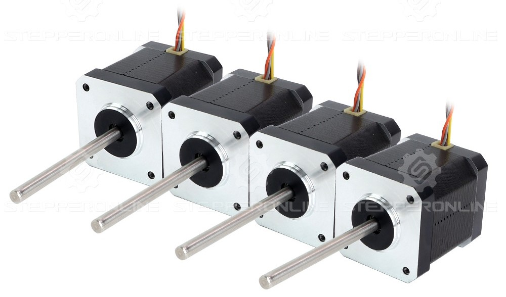

# Siboor Trident AWD June 2024 Hardware Mods

Mods will be sorted in the order of assembly as they were implemented as the Trident was being built. 
The rating system below is taken from [Deepfriedchril](https://github.com/Deepfriedchril/Siboor_Trident_AWD_June_2024):
| Emoji | Description |
| ------------ | ----- | 
| 💯 |  Highly recomended |
| 👍 | Nice to have |
| 🤷‍ | Could go either way |
| 👎 | Not recomended |
| ❓ | Unknown |
| ✔ | Yes |
| ❌ | No |
## Frame Mods

### 2020 Corner Brackets
| Extra Parts: ✔ | Recommended: 💯 |
| -------------- | --------------- |

Improves frame rigidity. Might be possible to use as a 'squaring-guide' when assembling the frame. I would recommend using at least 2040 corner brackets. Could 3D print some brackets (PLANNED)

- [ ] 16x 2020 Brackets (Plenty on AliExpress)
- [ ] 32x M5 Hammerhead Nuts
- [ ] 32x M5x8 Bolts (SHCS or BHCS)

## Motion System

### OMC NEMA17 Steppers
| Extra Parts: ✔ | Recommended: 👍 |
| -------------- | --------------- |

Found to help with VFA, good tuning may help. QoL upgrade if anything. Cables need terminating. Cables are nicely twisted with spaced zipties, don't bother trimming and just bunch them.

- [ ] 4x [OMC NEMA17](https://www.omc-stepperonline.com/4pcs-nema-17-high-temp-stepper-motor-55ncm-77-93oz-in-55mm-round-shaft-insulation-class-h-180c-4-17hs19-2504s-h-v1)
- [ ] 4x [Molex Micro-Fit 3.0, Dual Row, 4 Circuit, Receptacle Housing](https://www.molex.com/en-us/part-list/0186?taxonomyPathValueLast=Connector%20Housings&physical.circuitsMaximum=4) (Part Numbers: 430250400, 430250408, 430250410)
- [ ] 16x [Micro-Fit 3.0 Crimp Terminal, Female, 24-20 AWG](https://www.molex.com/en-us/part-list/0186?taxonomyPathValueLast=Crimp%20Terminals) (Part Numbers: 430300001, 430300002, 430300003)

### Active Stepper Cooling
| Extra Parts: ✔ | Recommended: 🤷 |
| -------------- | --------------- |

Cooler Steppers = Lower Resistace = Higher Current = Stonks. Probably only worth doing heatsink and fans if running a stepper tune.

- [ ] 4x [40x40x11mm Heatsink](https://www.aliexpress.com/item/1005009193295239.html?spm=a2g0o.order_list.order_list_main.23.641a1802zcetPr)
- [ ] 4x [4010 12V Fans](https://www.aliexpress.com/item/32960376174.html?spm=a2g0o.order_list.order_list_main.35.641a1802zcetPr)
- [ ] 4x [Nema 17 Heatsink and Fan Adapter Mount](https://www.thingiverse.com/thing:4602456)
